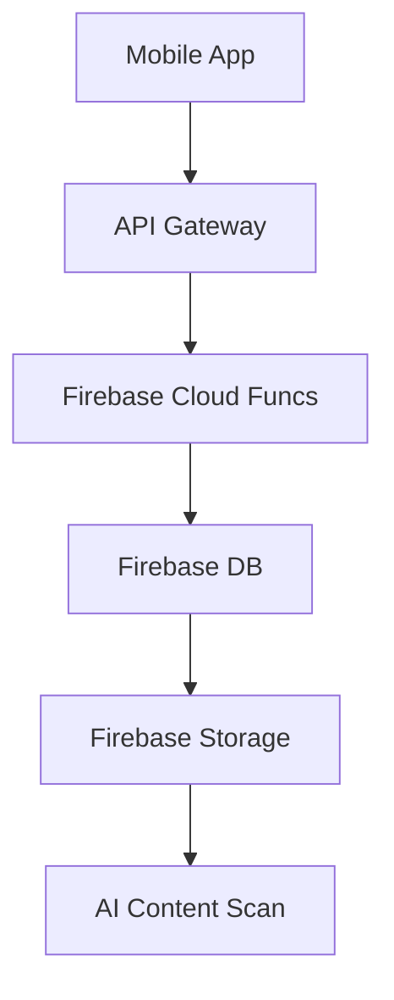

# Flimmer System Architecture

This document provides a comprehensive overview of the Flimmer platform's technical architecture. It is designed to be a single source of truth for our engineering team and a clear summary for stakeholders.

---

## 1. Guiding Principles

Our architecture is built on three core principles:
-   **Event-Driven**: The system reacts to events, making it flexible and easy to extend.
-   **Serverless First**: We leverage managed, serverless components to scale automatically and reduce operational overhead.
-   **Privacy by Design**: Security is built into the foundation through isolated services and strict data access policies.

---

## 2. Core Architecture: BFF & Headless Backend

Our system is composed of two primary layers: a **Backend-for-Frontend (BFF)** that powers our user-facing clients, and a **Headless Backend** that handles all core business logic.

```
+--------------------------+        +--------------------------+
|   Clients                |        |   BFF Layer (Smart Proxy)|
|--------------------------|        |--------------------------|
|                          |        |                          |
|   [Admin Web Dashboard]  |------->|   [Next.js API Routes]   |
|   [Flimmer Mobile App]   |        |                          |
+--------------------------+        +--------------------------+
             |                                  |
             | (Directly for Mobile App)        | (For Web Dashboard)
             |                                  |
             v                                  v
+--------------------------------------------------------------+
|   Headless Backend (Firebase)                                |
|--------------------------------------------------------------|
|                                                              |
|   [Cloud Functions] <--> [Firestore DB] <--> [Cloud Storage] |
|        ^                                                     |
|        |                                                     |
|   [Authentication] <-----------------------------------------+
|        ^
|        |
|   [Remote Config]
|        ^
|        |
|   [Push Notifications]
|
+--------------------------------------------------------------+
```

---

## 3. Technical ASCII Diagrams

### High-Level System Architecture

```
┌─────────────────────────────────────────────────────────────────────────────────────┐
│                                   CLIENT LAYER                                     │
├─────────────────────────────────────────────────────────────────────────────────────┤
│  ┌─────────────────┐   ┌─────────────────┐   ┌─────────────────┐                   │
│  │   Parent Web    │   │  Mobile App     │   │   Admin Web     │                   │
│  │   Dashboard     │   │  (iOS/Android)  │   │   Dashboard     │                   │
│  │  (Next.js)      │   │ (React Native)  │   │  (Next.js)      │                   │
│  │                 │   │                 │   │                 │                   │
│  │ • Real-time     │   │ • Child UI      │   │ • Operations    │                   │
│  │   monitoring    │   │ • Parent UI     │   │ • Analytics     │                   │
│  │ • Content       │   │ • Safety tools  │   │ • Moderation    │                   │
│  │   approval      │   │ • Location      │   │ • Compliance    │                   │
│  └─────────────────┘   └─────────────────┘   └─────────────────┘                   │
│           │                      │                      │                           │
└───────────│──────────────────────│──────────────────────│───────────────────────────┘
            │                      │                      │
            │                      │                      │
┌───────────│──────────────────────│──────────────────────│───────────────────────────┐
│           │                      │                      │       API GATEWAY        │
│           │                      │                      │                           │
│  ┌────────▼──────────────────────▼──────────────────────▼────┐                     │
│  │                    BFF (Backend for Frontend)             │                     │
│  │                        Next.js API Routes                │                     │
│  │                                                           │                     │
│  │ • Authentication & Authorization                          │                     │
│  │ • Request Validation & Rate Limiting                     │                     │
│  │ • Data Aggregation & Formatting                          │                     │
│  │ • Real-time WebSocket Management                          │                     │
│  │ • GDPR Compliance Layer                                   │                     │
│  └───────────────────────────────────────────────────────────┘                     │
│              │                                │                                    │
└──────────────│────────────────────────────────│────────────────────────────────────┘
               │                                │
               │                                │
┌──────────────│────────────────────────────────│────────────────────────────────────┐
│              │                                │         FIREBASE BACKEND          │
│              │                                │                                    │
│  ┌───────────▼─────────┐             ┌────────▼─────────┐                         │
│  │   Firebase Auth     │             │  Cloud Functions │                         │
│  │                     │             │                  │                         │
│  │ • MitID Integration │◄───────────►│ • Content AI     │                         │
│  │ • Parent/Child      │             │   Analysis       │                         │
│  │   Role Management   │             │ • Safety Engine  │                         │
│  │ • Session Security  │             │ • Notifications  │                         │
│  └─────────────────────┘             │ • Data Export    │                         │
│              │                       │ • GDPR Tools     │                         │
│              │                       └──────────────────┘                         │
│  ┌───────────▼─────────┐                      │                                   │
│  │    Firestore DB     │                      │                                   │
│  │                     │             ┌────────▼─────────┐                         │
│  │ • User Profiles     │             │  Cloud Storage   │                         │
│  │ • Family Data       │             │                  │                         │
│  │ • Activity Logs     │             │ • Video Content  │                         │
│  │ • Safety Events     │             │ • Image Analysis │                         │
│  │ • Audit Trails      │             │ • Backups        │                         │
│  │ • GDPR Records      │             │ • Encrypted Data │                         │
│  └─────────────────────┘             └──────────────────┘                         │
│              │                                │                                   │
└──────────────│────────────────────────────────│───────────────────────────────────┘
               │                                │
               │                                │
┌──────────────│────────────────────────────────│───────────────────────────────────┐
│              │                                │       EXTERNAL SERVICES          │
│              │                                │                                   │
│  ┌───────────▼─────────┐             ┌────────▼─────────┐                         │
│  │      MitID/NemID    │             │  Google Cloud AI │                         │
│  │   Identity Provider │             │                  │                         │
│  │                     │             │ • Vision API     │                         │
│  │ • Parent            │             │ • SafeSearch     │                         │
│  │   Verification      │             │ • Translation    │                         │
│  │ • Legal Compliance  │             │ • AutoML Models  │                         │
│  └─────────────────────┘             └──────────────────┘                         │
│              │                                │                                   │
│  ┌───────────▼─────────┐             ┌────────▼─────────┐                         │
│  │       Stripe        │             │     Sentry       │                         │
│  │   Payment Gateway   │             │  Error Tracking  │                         │
│  │                     │             │                  │                         │
│  │ • Subscription      │             │ • Performance    │                         │
│  │   Management        │             │   Monitoring     │                         │
│  │ • GDPR Compliant    │             │ • Alert System   │                         │
│  └─────────────────────┘             └──────────────────┘                         │
└─────────────────────────────────────────────────────────────────────────────────────┘
```

### Real-Time Safety Data Flow

```
┌─────────────────────────────────────────────────────────────────────────────────────┐
│                                SAFETY EVENT FLOW                                   │
└─────────────────────────────────────────────────────────────────────────────────────┘

1. Content Upload (Child Action)
   ┌──────────────┐
   │  Child App   │──► Video/Image Upload
   └──────────────┘         │
                            ▼
                   ┌─────────────────┐
                   │ Cloud Storage   │──► Trigger: New Content
                   └─────────────────┘         │
                                               ▼
2. AI Safety Analysis
                   ┌─────────────────┐
                   │ Cloud Function  │──► Google Vision API
                   │ (AI Analysis)   │    • NSFW Detection
                   └─────────────────┘    • Violence Check
                            │             • Age Appropriate
                            ▼
                   ┌─────────────────┐
                   │ Safety Score    │──► Store Results
                   │ Generated       │    Risk Level: Low/Med/High
                   └─────────────────┘         │
                            │                  ▼
                            │         ┌─────────────────┐
                            │         │  Firestore DB   │
                            │         │ • Safety Event  │
                            │         │ • Audit Trail   │
                            │         └─────────────────┘
                            ▼
3. Decision Engine
                   ┌─────────────────┐
                   │ Safety Engine   │
                   │                 │
   ┌──────────────►│ if(score > 0.8) │
   │               │   auto_approve  │
   │               │ else if(> 0.5)  │◄────┐
   │               │   parent_review │     │
   │               │ else            │     │
   │               │   auto_reject   │     │
   │               └─────────────────┘     │
   │                        │              │
   ▼                        ▼              │
Auto-Approve        Parent Notification    │
   │                        │              │
   │               ┌─────────────────┐     │
   │               │ Push/WebSocket  │     │
   │               │ to Parent App   │     │
   │               └─────────────────┘     │
   │                        │              │
   ▼                        ▼              │
Published              Parent Dashboard    │
Content                 Shows Pending      │
   │                    Content            │
   │                        │              │
   │                        ▼              │
   │               ┌─────────────────┐     │
   │               │ Parent Action:  │     │
   │               │ Approve/Reject  │─────┘
   │               └─────────────────┘
   │                        │
   │                        ▼
   │               ┌─────────────────┐
   │               │ Update Content  │
   │               │ Status & Audit  │
   │               └─────────────────┘
   │                        │
   └────────────────────────┼────────────────────────────────────┐
                            ▼                                    │
4. Real-Time Updates                                             │
                   ┌─────────────────┐                          ▼
                   │ WebSocket Push  │                ┌─────────────────┐
                   │ to All Clients  │                │ Analytics &     │
                   │                 │                │ Compliance      │
                   │ • Child App     │                │ Recording       │
                   │ • Parent Web    │                │                 │
                   │ • Admin Panel   │                │ • GDPR Logs     │
                   └─────────────────┘                │ • Safety Metrics│
                            │                         │ • Audit Trail   │
                            ▼                         └─────────────────┘
                   ┌─────────────────┐
                   │ UI Updates:     │
                   │ • Content State │
                   │ • Notifications │
                   │ • Activity Feed │
                   └─────────────────┘
```

### Security & Privacy Architecture

```
┌─────────────────────────────────────────────────────────────────────────────────────┐
│                              SECURITY LAYERS                                       │
└─────────────────────────────────────────────────────────────────────────────────────┘

┌─────────────────────────────────────────────────────────────────────────────────────┐
│                            LAYER 1: AUTHENTICATION                                 │
├─────────────────────────────────────────────────────────────────────────────────────┤
│                                                                                     │
│  ┌─────────────────┐    ┌─────────────────┐    ┌─────────────────┐                │
│  │   Anonymous     │    │     Parent      │    │      Admin      │                │
│  │     Users       │    │     Users       │    │     Users       │                │
│  │                 │    │                 │    │                 │                │
│  │   ❌ BLOCKED    │    │ ✅ MitID Verify │    │ ✅ Multi-Factor │                │
│  │                 │    │ ✅ Role: Parent │    │ ✅ Role: Admin  │                │
│  │ No content      │    │ ✅ GDPR Consent │    │ ✅ Audit Logged │                │
│  │ access allowed  │    │ ✅ Child Links  │    │ ✅ IP Restricted│                │
│  └─────────────────┘    └─────────────────┘    └─────────────────┘                │
│           │                       │                       │                        │
└───────────│───────────────────────│───────────────────────│────────────────────────┘
            │                       │                       │
            ▼                       ▼                       ▼
┌─────────────────────────────────────────────────────────────────────────────────────┐
│                            LAYER 2: AUTHORIZATION                                  │
├─────────────────────────────────────────────────────────────────────────────────────┤
│                                                                                     │
│  ┌─────────────────────────────────────────────────────────────────────────────────┤
│  │                        Firebase Security Rules                                 │
│  │                                                                                 │
│  │  // Child Profile Access                                                       │
│  │  match /families/{familyId}/children/{childId} {                               │
│  │    allow read, write: if request.auth != null &&                               │
│  │      resource.data.parentId == request.auth.uid &&                             │
│  │      request.auth.token.verified == true                                       │
│  │  }                                                                              │
│  │                                                                                 │
│  │  // Content Moderation                                                         │
│  │  match /content/{contentId} {                                                  │
│  │    allow read: if request.auth != null &&                                      │
│  │      (resource.data.approved == true ||                                        │
│  │       resource.data.parentId == request.auth.uid)                              │
│  │  }                                                                              │
│  │                                                                                 │
│  │  // Admin Operations                                                           │
│  │  match /admin/{document=**} {                                                  │
│  │    allow read, write: if request.auth != null &&                               │
│  │      request.auth.token.admin == true &&                                       │
│  │      request.auth.token.verified == true                                       │
│  │  }                                                                              │
│  └─────────────────────────────────────────────────────────────────────────────────┤
└─────────────────────────────────────────────────────────────────────────────────────┘
            │                       │                       │
            ▼                       ▼                       ▼
┌─────────────────────────────────────────────────────────────────────────────────────┐
│                            LAYER 3: DATA PROTECTION                                │
├─────────────────────────────────────────────────────────────────────────────────────┤
│                                                                                     │
│  ┌─────────────────┐    ┌─────────────────┐    ┌─────────────────┐                │
│  │   Encryption    │    │  Data Retention │    │   GDPR Rights   │                │
│  │                 │    │                 │    │                 │                │
│  │ • AES-256 Rest  │    │ • 12 Month Auto │    │ • Data Export   │                │
│  │ • TLS 1.3       │    │   Deletion      │    │ • Right Erase   │                │
│  │ • Key Rotation  │    │ • Backup Policy │    │ • Consent Mgmt  │                │
│  │ • HSM Protected │    │ • Audit Logs    │    │ • Breach Notice │                │
│  └─────────────────┘    └─────────────────┘    └─────────────────┘                │
│           │                       │                       │                        │
│           └───────────────────────┼───────────────────────┘                        │
│                                   ▼                                                │
│  ┌─────────────────────────────────────────────────────────────────────────────────┤
│  │                          Audit & Compliance                                    │
│  │                                                                                 │
│  │  Every Action Logged:                                                          │
│  │  • User Authentication Events                                                  │
│  │  • Data Access & Modifications                                                 │
│  │  • Content Uploads & Approvals                                                 │
│  │  • Safety Interventions                                                        │
│  │  • GDPR Data Requests                                                          │
│  │  • Admin Operations                                                            │
│  │                                                                                 │
│  │  Compliance Monitoring:                                                        │
│  │  • Real-time GDPR Violation Detection                                          │
│  │  • Automated Privacy Impact Assessment                                         │
│  │  • Data Processing Activity Records                                            │
│  │  • Breach Detection & Auto-Notification                                        │
│  └─────────────────────────────────────────────────────────────────────────────────┤
└─────────────────────────────────────────────────────────────────────────────────────┘
```

### Scalability & Performance Architecture

```
┌─────────────────────────────────────────────────────────────────────────────────────┐
│                             PERFORMANCE LAYERS                                     │
└─────────────────────────────────────────────────────────────────────────────────────┘

┌─────────────────────────────────────────────────────────────────────────────────────┐
│                               CDN LAYER                                            │
├─────────────────────────────────────────────────────────────────────────────────────┤
│  ┌───────────────┐  ┌───────────────┐  ┌───────────────┐  ┌───────────────┐      │
│  │   EU-West1    │  │   EU-North1   │  │   US-East1    │  │   Asia-SE1    │      │
│  │   (Primary)   │  │  (Secondary)  │  │   (Global)    │  │   (Expansion) │      │
│  │               │  │               │  │               │  │               │      │
│  │ • Static      │  │ • Failover    │  │ • Analytics   │  │ • Future      │      │
│  │   Assets      │  │ • Backup      │  │ • Testing     │  │ • Market      │      │
│  │ • Images      │  │ • DR Site     │  │ • A/B Tests   │  │ • Expansion   │      │
│  │ • Videos      │  │               │  │               │  │               │      │
│  └───────────────┘  └───────────────┘  └───────────────┘  └───────────────┘      │
└─────────────────────────────────────────────────────────────────────────────────────┘
            │                       │                       │
            ▼                       ▼                       ▼
┌─────────────────────────────────────────────────────────────────────────────────────┐
│                            CACHING STRATEGY                                        │
├─────────────────────────────────────────────────────────────────────────────────────┤
│                                                                                     │
│  ┌─────────────────┐    ┌─────────────────┐    ┌─────────────────┐                │
│  │  Browser Cache  │    │  Next.js Cache  │    │ Firebase Cache  │                │
│  │                 │    │                 │    │                 │                │
│  │ • Static Assets │    │ • API Responses │    │ • User Sessions │                │
│  │ • User Profile  │    │ • Page Data     │    │ • Query Results │                │
│  │ • Content Prefs │    │ • Component     │    │ • Real-time     │                │
│  │                 │    │   States        │    │   Subscriptions │                │
│  │ TTL: 1 hour     │    │ TTL: 5 minutes  │    │ TTL: 30 seconds │                │
│  └─────────────────┘    └─────────────────┘    └─────────────────┘                │
└─────────────────────────────────────────────────────────────────────────────────────┘
            │                       │                       │
            ▼                       ▼                       ▼
┌─────────────────────────────────────────────────────────────────────────────────────┐
│                          AUTO-SCALING RULES                                        │
├─────────────────────────────────────────────────────────────────────────────────────┤
│                                                                                     │
│  Cloud Functions Scaling:                                                          │
│  ┌─────────────────────────────────────────────────────────────────────────────────┤
│  │ AI Content Analysis:                                                           │
│  │ • Min Instances: 5                                                             │
│  │ • Max Instances: 100                                                           │
│  │ • Scale Trigger: >10 pending uploads                                          │
│  │ • Memory: 1GB per instance                                                     │
│  │                                                                                │
│  │ Real-time Notifications:                                                       │
│  │ • Min Instances: 10                                                            │
│  │ • Max Instances: 500                                                           │
│  │ • Scale Trigger: >50 concurrent WebSocket connections                         │
│  │ • Memory: 512MB per instance                                                   │
│  │                                                                                │
│  │ Data Export (GDPR):                                                           │
│  │ • Min Instances: 0                                                             │
│  │ • Max Instances: 10                                                            │
│  │ • Scale Trigger: On-demand only                                               │
│  │ • Memory: 2GB per instance                                                     │
│  └─────────────────────────────────────────────────────────────────────────────────┤
│                                                                                     │
│  Database Scaling:                                                                 │
│  ┌─────────────────────────────────────────────────────────────────────────────────┤
│  │ Firestore Collections:                                                         │
│  │ • families: Partitioned by region                                             │
│  │ • content: Sharded by date                                                    │
│  │ • activity: Auto-archived after 90 days                                      │
│  │ • safety_events: Indexed by priority + timestamp                              │
│  │                                                                                │
│  │ Read/Write Quotas:                                                             │
│  │ • Reads: 1M/day per family (burst: 10K/hour)                                  │
│  │ • Writes: 100K/day per family (burst: 1K/hour)                                │
│  │ • Real-time listeners: Max 100 per family                                     │
│  └─────────────────────────────────────────────────────────────────────────────────┤
└─────────────────────────────────────────────────────────────────────────────────────┘
            │                       │                       │
            ▼                       ▼                       ▼
┌─────────────────────────────────────────────────────────────────────────────────────┐
│                          MONITORING & ALERTING                                     │
├─────────────────────────────────────────────────────────────────────────────────────┤
│                                                                                     │
│  ┌─────────────────┐    ┌─────────────────┐    ┌─────────────────┐                │
│  │  Uptime Robot   │    │  Sentry Error   │    │ Firebase Perf   │                │
│  │                 │    │   Monitoring    │    │   Monitoring    │                │
│  │ • 1min checks   │    │                 │    │                 │                │
│  │ • 5 locations   │    │ • Error Rate    │    │ • App Start     │                │
│  │ • SMS alerts    │    │ • Performance   │    │ • Network Req   │                │
│  │ • Status page   │    │ • User Impact   │    │ • Screen Render │                │
│  └─────────────────┘    └─────────────────┘    └─────────────────┘                │
│                                                                                     │
│  Performance Targets:                                                              │
│  • Page Load: <2 seconds (P95)                                                     │
│  • API Response: <500ms (P95)                                                      │
│  • Real-time Updates: <100ms (P95)                                                 │
│  • Uptime SLA: 99.9% (8.7 hours downtime/year)                                     │
│  • Content Moderation: <30 seconds (P95)                                           │
│  • Parent Notification: <5 seconds (P95)                                           │
└─────────────────────────────────────────────────────────────────────────────────────┘
```

---

## 4. Key Architectural Patterns in Detail

### **A. Real-Time Push Synchronization**

This pattern ensures that actions on one device are instantly reflected on all other relevant devices without requiring manual refreshes.

**The Flow:**
1.  **Child Uploads Content**: The mobile app calls a Cloud Function to process the new content.
2.  **Backend Invalidates Cache & Pushes**: After successfully processing the content, the Cloud Function sends a silent **Push Notification** via our Push Service (e.g., Firebase Cloud Messaging) to the relevant parent devices.
3.  **Parent's App Reacts**: The parent's app receives the silent notification. Our data-fetching library (React Query) understands this as a signal that its local data is stale and automatically refetches the latest content moderation queue from the backend.
4.  **UI Updates Seamlessly**: The parent's dashboard updates to show the new item, creating a magical, real-time experience.

### **B. Dynamic Content Delivery**

This pattern allows our content team to update the app's curated videos and interactive quizzes without needing an app store release.

**The Flow:**
1.  **Admin Publishes Content**: An admin uses the web dashboard to add a new video and quiz. The dashboard calls our Next.js BFF.
2.  **BFF Updates Remote Config**: The BFF updates a JSON configuration file stored in **Firebase Remote Config**.
3.  **Mobile App Fetches on Launch**: The next time a user opens the mobile app, it fetches this latest JSON configuration.
4.  **UI is Dynamically Rendered**: The app parses the JSON and builds the UI dynamically, showing the new video and quiz.

---

## 5. Strategic Benefits

-   **Low Operational Cost**: We only pay for what we use.
-   **High Scalability**: The architecture can handle massive user growth automatically.
-   **Rapid Development**: We leverage managed services to build features faster.
-   **Superior User Experience**: Our real-time and dynamic features create a modern, engaging experience for our users.

## Beneficial Ideas for Future Architecture

This foundation enables powerful future enhancements:

-   **Multi-Cloud AI**: While our AI Safety Engine might start in Google Cloud, its event-driven nature means we can easily integrate with other best-in-class AI services from AWS or Azure in the future without re-architecting the entire system.
-   **Data Warehousing for Analytics**: We can set up an automated data pipeline that streams events from Firestore to a data warehouse like BigQuery. This would allow us to run complex analytics and train our machine learning models without impacting the performance of the live production database.

## System Architecture

- Modular, scalable design leveraging Firebase backend services and Expo React Native frontend.
- Separation of concerns via distinct modules: Authentication, User Management, Video Handling, Moderation, Notifications, and Parental Controls.
- Use of event-driven architecture with cloud functions responding to user actions and system events.
- Edge caching and CDN usage for content delivery and performance optimization.

## Key Components

### Authentication & User Management
- Firebase Authentication managing sign-up, login, and roles.
- Parent and child account relations with role-based access control.

### Video Storage and Processing
- Firebase Storage for video and image assets.
- Background processing for video transcoding and AI content scanning integration.

### Moderation System
- Real-time flagging and moderation queue management.
- AI-assisted content scanning with fallback manual review.
- Parental dashboard integration for content approval.

### Notifications
- Push notifications and in-app alerts managed via Firebase Cloud Messaging.
- Notification templates and escalation workflows.

### API Gateway (Proposed Role)
- Central point for authentication, authorization, and routing.
- Implements rate limiting, logging, and security policies.
- Supports versioning and service discovery.

## Data Flow Overview

```plaintext
User Upload --> Firebase Storage --> AI Scan (Async) --> Moderation Queue --> Parental Approval --> Publish
```

## Scalability Considerations

- Auto-scaling Firebase cloud functions handle backend logic.
- CDN with edge caching reduces latency for global users.
- Modular services allow independent scaling.
- Monitoring tools (Firebase Analytics, Sentry) provide performance insights.

## Security & Compliance

- End-to-end encryption of user data.
- Role-based access ensures data isolation.
- Audit logging for all moderation and parental actions.
- Compliance with GDPR, COPPA, and local regulations.

## Diagram

